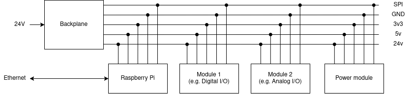

Open Modular Test Bench
=======================

This is the start of jet another modular test bench.

Starting Idea
-------------

Overall Layout
~~~~~~~~~~~~~~

The system consists of one backplane and up to 6 modules.
Each module is connected via the backplane to an SPI bus.
The SPI Master will be a Raspberry-PI 5 and should hopefully be able to reach
10Mhz.

Power wise, the backplane provides 3v3 and 5v for the modules only and 24v for
I/O wich each module needs to step down itself.

For the beginning only 2 modules are planned:

* Power modules
* Digital I/O modules

The basic features for the modules are:

* Backplane
    * SPI Bus (hopefully 10Mhz)
    * Provides for modules
        * 3v3
        * 5v 
    * Raspberry-PI connection
    * MCU for housekeeping / configuration
    * Status leds
* Power
    * 6 Vcc/GND Pairs
    * Each individually programmable with
        * 3v3
        * 5v 
        * 12v 
        * 24v
        * Programmalble (Lab bench style)
    * Current limiting
    * Leds for status and voltage indicator
* Digital I/O
    * 12 I/O Pins
    * Possible Voltages 
        * 3v3
        * 5v 
        * 12v 
        * 24v
        * (Programmalble (maybe?))
    * Current limiting
    * Push/pull for Output
    * Pull-Up/Down for Input
    * Status leds and voltage indicators
    * local RAM (for data logging and MCU program)
    * (FPGA co-processor with extra RAM)

The Idea is, that each module is programmable an can execute some user program
for automated I/O without using the Raspberry-PI for computing.

TODO
----

1. Create basic backplane
2. Create basic digital I/O module
3. Create basic Power module

