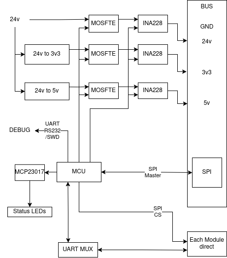

OpenMTB Backplane
=================

Overview
--------

The Open Modular Test Bench (OpenMTB) **backplane** serves as the core **power and communication hub** for all connected modules. It consists of **three main areas**:

1. **Power Distribution** – Includes regulated **3.3V, 5V, and 24V** power rails with controlled enable/disable functionality.
2. **Communication Bus** – SPI-based data exchange between the **backplane MCU** and all connected modules.
3. **MCU Control Area** – Handles **voltage monitoring, power sequencing, and communication management**.

The **backplane MCU** controls the power rails via **MOSFETs** to prevent inrush current issues during boot-up. The **power sequence** follows:
1. **3.3V and 5V enabled first** – Allows the main MCU to initialize all modules.
2. **24V enabled last** – Fully powers the system after initialization is complete.

All **power rails are monitored** using the **INA228/INA238** for **voltage and current sensing**.

Power System
------------

Voltage Rail Enable Sequence
^^^^^^^^^^^^^^^^^^^^^^^^^^^^

Each **power rail** is switched using an **SQJ433EP (P-Channel MOSFET)**, controlled via an **NX138BKMYL (N-Channel MOSFET)** for **logic-level conversion**. This setup ensures controlled power-up and power-down behavior.

.. list-table:: Voltage Rail Enable Sequence
   :widths: 25 25 50
   :header-rows: 1

   * - **Voltage Rail**
     - **Current Limit**
     - **Switching Method**
   * - 3.3V
     - 2A
     - MOSFET controlled by MCU
   * - 5V
     - 5A
     - MOSFET controlled by MCU
   * - 24V
     - 10A (estimated)
     - MOSFET controlled by MCU

Current & Voltage Monitoring
^^^^^^^^^^^^^^^^^^^^^^^^^^^^

The **INA228** is used to measure **current and voltage** across all power rails. This data is **sent to the backplane MCU**, enabling real-time power monitoring.

Communication Bus
-----------------

The **bus** consists of:
- **Power Rails**: 3.3V, 5V, 24V, and GND.
- **SPI Lines**: Shared between the backplane MCU and all modules.
- **Chip Select (CS) Lines**: Dedicated per module.
- **UART Lines**: Used for programming and debugging.

To handle **multiple UART connections**, two **SN74LV4052A multiplexers** allow the MCU to interface with up to **6 modules + backplane MCU**.

Status LEDs
-----------

The **backplane includes multiple status LEDs**, categorized as:

MCU-Controlled Status LEDs
^^^^^^^^^^^^^^^^^^^^^^^^^^

.. list-table:: MCU-Controlled LEDs
   :widths: 25 25 50
   :header-rows: 1

   * - **Function**
     - **Color**
     - **Behavior**
   * - 3.3V Power Status
     - Bi-color (Red/Green)
     - Red: Power requested but not detected, Green: Power OK
   * - 5V Power Status
     - Bi-color (Red/Green)
     - Red: Power requested but not detected, Green: Power OK
   * - 24V Power Status
     - Bi-color (Red/Green)
     - Red: Power requested but not detected, Green: Power OK
   * - Overcurrent Warning
     - Red
     - On = Overcurrent detected
   * - Overtemperature Warning
     - Red
     - On = Overtemperature detected
   * - System Fault/Error
     - Bi-color (Red/Green)
     - Red: Error, Green: System OK
   * - MCU Heartbeat
     - Blue
     - Slow Blink = Normal, Fast Blink = Error
   * - Firmware Update Mode
     - Yellow
     - Blinking = Firmware update in progress

Hardware-Controlled Communication LEDs
^^^^^^^^^^^^^^^^^^^^^^^^^^^^^^^^^^^^^^

.. list-table:: Hardware-Controlled LEDs
   :widths: 30 70
   :header-rows: 1

   * - **Function**
     - **Implementation**
   * - SPI Activity LED
     - Schmitt Trigger (74HC14) or XOR Edge Detector (74HC86) on SCK
   * - UART TX LED
     - MOSFET-based detection on TX line
   * - UART RX LED
     - MOSFET-based detection on RX line
   * - I2C Activity LED
     - RC Filter + Transistor on SCL

All **MCU-controlled LEDs** are managed via **GPIO expanders**:
- **MCP23S17 (SPI, 16 GPIOs)**
- **MCP23017 (I2C, 16 GPIOs)**
- **74HC595 (SPI Shift Register, 8 per chip) for daisy-chaining additional LEDs**

Module-Specific Communication
-----------------------------

Each **module** has dedicated SPI **CS lines** and a **UART connection** for firmware updates and debugging.

To expand UART connections, one **SN74LV4052A multiplexers** is used, providing:
- **Up to 4 UART connections **.
- **Seamless MCU communication with each module.**

Future Improvements
-------------------

- **Optimize SPI bus performance** by evaluating **bus speed and signal integrity**.
- **Test overcurrent protection thresholds** with INA228.
- **Review power sequencing logic** for improved stability.
- **Enhance system monitoring with additional error handling LEDs.**

**Final Thoughts**
^^^^^^^^^^^^^^^^^^

- **Backplane MCU enables and monitors power rails.**
- **High-side MOSFET switching with logic-level conversion (SQJ433EP + NX138BKMYL).**
- **Real-time current & voltage sensing with INA228.**
- **Efficient UART handling using SN74LV4052A multiplexers.**
- **MCU-controlled and hardware-driven LEDs for system diagnostics.**
